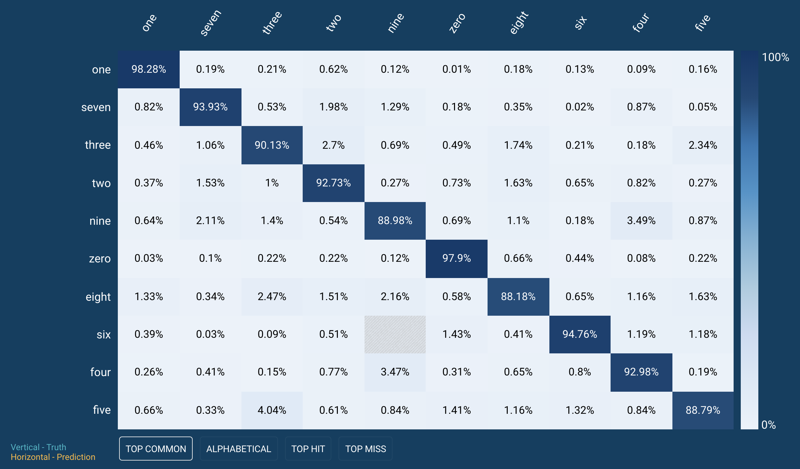
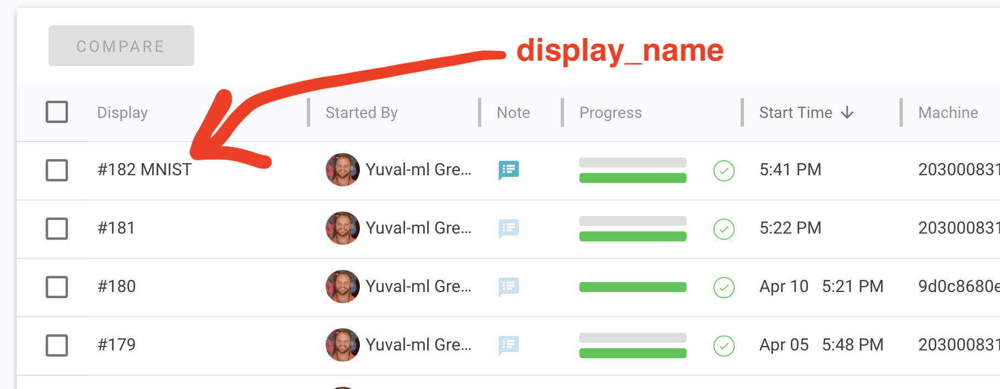

# Introduction

In this tutorial we will take the existing implementation of a deep learning algorithm and integrate it into the MissingLink system. 

We start with a [code sample](https://scikit-learn.org/stable/auto_examples/neural_networks/plot_mnist_filters.html) that trains a model based on the MNIST dataset using a multi-layer perceptron, and add the MissingLink SDK.

# Getting Started

## Prerequisites

To run this tutorial, you will need a MissingLink account. If you don't have one, [head to the MissingLink website and sign up](https://missinglink.ai/console/signup/userdetails).

You will also need to have [Python](https://www.python.org/downloads/) and [Docker](https://docs.docker.com/install/#supported-platforms) installed on your workstation.

---
**NOTE**

This tutorial assumes you’re using virtualenv to scope your working environment.
If you don't have it installed, you can follow [this guide](https://packaging.python.org/guides/installing-using-pip-and-virtualenv/) to get it set up.

---

## First things first ...

Notice it contains the program file, `mnist.py`, and a `requirements.txt` file.

To make changes, you will need to create a copy of the repo and fetch it to your local development environment. Clone this examples repository locally in your workstation. Click `Clone or download` in Github:


Now copy the URL for cloning the repository:


Next, let’s open a terminal and `git clone` using the pasted URL of your forked repository:  

```bash
$ git clone git@github.com:missinglinkai/examples.git
$ cd examples
```

Now that the code is on your machine, let's prepare the environment. Run the following commands:

```bash
$ cd examples/scikit-learn/tutorial
$ python3 -m virtualenv env
$ source env/bin/activate
$ pip install -r requirements.txt
```

## Let's run it

You can try to run the example:

```bash
$ python mnist.py
```

<!--  -->

As you can see, the code runs the experiment in a few epochs.

# Integrating the MissingLink SDK

Now, let's see how, by adding a few lines of code and a few commands, we're able to follow the experiment in MissingLink's web dashboard.

## Install and authenticate the MissingLink CLI

MissingLink provides a command line interface (CLI) that allows you to control everything from the terminal.

Let's go ahead and install it:

```bash
$ pip install missinglink
```

Next, authenticate with the MissingLink backend.

---
**NOTE**

Once you run the following command, a browser window launches and accesses the MissingLink website.

If you're not logged on, you will be asked to log on. When the process is completed, you will get a message to go back to the terminal.


---

```bash
$ ml auth init
```

## Creating a project

You can create projects and see a list of all your projects on the [MissingLink web dashboard](https://missinglink.ai/console). But MissingLink also allows you to manage projects from the command line. Let's create a new project for this tutorial:

```bash
$ ml projects create --display-name tutorials
```

---
**NOTE**

 Run `ml projects list` to list your projects from the command line.

---

## Create an experiment on MissingLink

Open the `mnist.py` script file, import the MissingLink SDK and instantiate an `SkLearnProject`:
```diff
# ...
from sklearn.datasets import fetch_openml, get_data_home
from sklearn.neural_network import MLPClassifier

+import missinglink
+
+project = missinglink.SkLearnProject()

print(__doc__)

# Load data from https://www.openml.org/d/554
# ...
```

Now we need to define the different stages of the experiment in a context. Also we'll report the `accuracy` metric.

```diff
# ...
+with project.train(model) as train:
    print("fit")
    model.fit(data_train, target_train)
    data_train_pred = model.predict(data_train)
    accuracy = accuracy_score(target_train, data_train_pred)
+   train.add_metric('accuracy', accuracy)
    print("Training set accuracy: %f" % accuracy)
```

## Run the integrated experiment
We're all set up to run the experiment again, but this time to see it in the Missing Link dashboard.  

Go back to the terminal and run the script again:

```bash
$ python mnist.py
```

You should see the initialization and the beginning of training. Now, switch back to the MissingLink dashboard.

Open the [MissingLink dashboard](https://missinglink.ai/console) and click the projects toolbar button on the left. In this page, you should see the list of experiments that belong to your project.


Choose the **tutorials** project. Your experiment appears.  


---
**That's it, you're done :)**

Feel free to browse through the different tabs of the experiment you're running and see how the metrics update as the experiment progresses. Check out https://missinglink.ai/docs for more information.

---

# Next steps

## Confusion matrix and test data

Though `sklearn` comes with a confusion matrix of its own, it's not that easy to use.

```
Confusion matrix:
[[5767    2   23    7    9   14   30    5   42    3]
 [   0 6632   36   20    8    7   16   12   17    2]
 [  50   24 5545   66   55    8   51  104   83   13]
 [  19   26  154 5556   14  102   16   60  112   50]
 [  13   20   34   14 5403    9   52   19   37  243]
 [  73   21   20  232   32 4816   89   18   71   78]
 [  61   20   47    1   62   65 5565    1   38    2]
 [   9   54  104   26   60    3    0 5838   20  109]
 [  32   69  105  148   42   82   45   31 5201  126]
 [  31   31   39   87  191   35   11  133   63 5359]]
```

By adding `add_test_data` you'll be able to see a visual and normalized confusion matrix in the `Test` tab of your experiment.

```diff
+with project.test() as test:
    print("test")
    data_test_pred = model.predict(data_test)
    accuracy = accuracy_score(target_test, data_test_pred)
+   test.add_metric('accuracy', accuracy)
+   test.add_test_data(target_test, data_test_pred)
    print("Test set accuracy: %f" % accuracy)
    print("Confusion matrix:")
    print(confusion_matrix(target_test, data_test_pred))
```

You can resort the MissingLink visual confusion matrix by top hits, misses, alphabetical or most common instances. It's powerful and we gain many insights from it, you should try it out.


## Custom class names
You can replace the class names in your confusion matrix using
`project.set_properties(class_mapping=`. In the case of MNIST it's not too useful,
but for example when training on Imagenet it's super helpful.

```diff
+ class_mapping = {
+     "0": "zero",
+     "1": "one",
+     "2": "two",
+     "3": "three",
+     "4": "four",
+     "5": "five",
+     "6": "six",
+     "7": "seven",
+     "8": "eight",
+     "9": "nine",
+ }
+ project.set_properties(class_mapping=class_mapping)
```



## Custom hyperparams

Many hyper parameters are captured automatically by MissingLink such as the model optimizer and parameters. We can record any other hyper parameter using the `set_hyperparams` method.

```diff
elif model_type == "forest":
    model = ensemble.RandomForestClassifier(n_estimators=20)

+project.set_hyperparams(split=split, rotate=rotate)
```

## Set a project name and description

You can make it easier for yourself to identify this exact script run by modifying the `display_name` and `description` properties. Consider including a note from the environment variables or command line options. Here we simply include a string.

```diff
project = missinglink.SkLearnProject()

+ # Optional: Name this experiment. `display_name` is always visible in the experiments
+ # table. While the `description` is accessible by clicking the note icon.
+ project.set_properties(
+     display_name="MNIST",
+     description="Using scikit-learn")

```



## Commit the code changes

Let's commit our code to the repo. Go to your terminal and run the following commands:

```bash
$ git add .
$ git commit -m "integrate with missinglink"
$ git push
```

# Summary

This tutorial demonstrated how to take an existing scikit learn code sample and integrate MissingLink's SDK with it. Your team now gained experimentation visibility and got a collaboration boost.

To learn more about what you can do, [head to the MissingLink docs](https://missinglink.ai/docs).